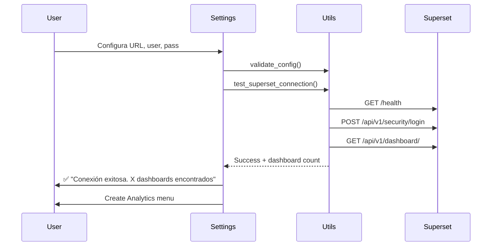
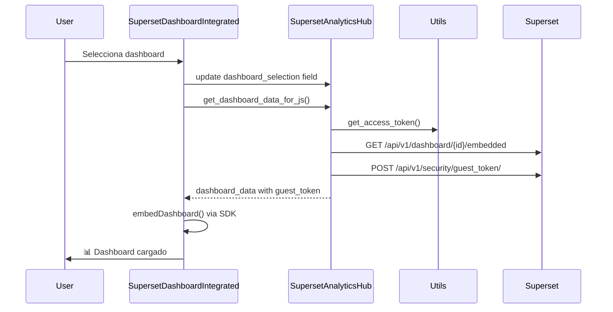
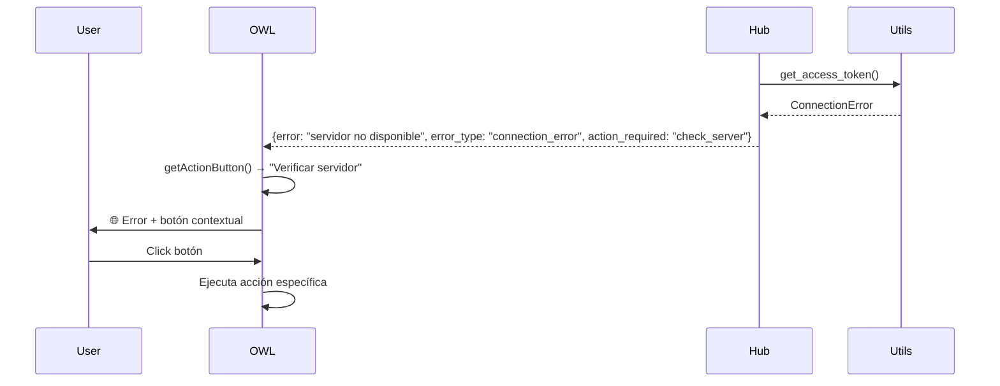

# 📊 Documentación Técnica Completa - Eticco Superset Integration

> **Propósito**: Documentación completa del funcionamiento actual del módulo para usar como contexto en futuros hilos, mejoras y resolución de errores.

## 🎯 Resumen del Módulo

**Módulo de Odoo 17** para integrar dashboards de Apache Superset de forma nativa, segura y profesional. Permite embeber dashboards con autenticación automática, cache inteligente y manejo robusto de errores.

### 🏆 Características Principales Implementadas

- ✅ **Integración nativa única**: Un solo componente OWL para selección + visualización
- ✅ **Auto-carga reactiva**: Dashboard carga automáticamente al seleccionar (sin botones)
- ✅ **Cache inteligente**: Tokens (4min) y estado del sistema (5min) para optimal performance 
- ✅ **Manejo profesional de errores**: 8+ tipos de error específicos con mensajes contextuales y acciones de recuperación
- ✅ **Configuración centralizada**: Settings integrados en Odoo con validación robusta
- ✅ **Lógica centralizada**: `superset_utils.py` para operaciones comunes y llamadas al servidor
- ✅ **Tests completos**: Tests de Odoo + tests standalone para escenarios de error

---

## 🏗️ Arquitectura del Sistema

### 📁 Estructura de Archivos

```
eticco_superset_integration/
├── models/
│   ├── __init__.py                          # Inicialización modelos
│   ├── res_config_settings.py               # ⚙️  Configuración en Settings
│   ├── superset_analytics_hub.py            # 🎯  Hub principal - Modelo central  
│   └── superset_utils.py                    # 🔧  Utilidades centralizadas
├── views/
│   ├── superset_config_views.xml            # ⚙️  Vista de configuración
│   └── superset_analytics_hub_views.xml     # 🎯  Vista del hub principal
├── static/src/fields/
│   ├── superset_dashboard_integrated.js     # 🦉  Componente OWL único
│   └── superset_dashboard_integrated.xml    # 🦉  Template del componente
├── security/
│   ├── ir.model.access.csv                  # 🔐  Permisos de acceso
│   └── superset_security.xml                # 🔐  Grupos de seguridad
├── data/
│   └── superset_data.xml                    # 📄  Datos iniciales
├── tests/
│   ├── test_superset_utils.py               # 🧪  Tests utilidades (12 tests)
│   ├── test_analytics_hub.py                # 🧪  Tests hub principal (18 tests)
│   ├── test_configuration_flow.py           # 🧪  Tests configuración (15 tests)
│   └── test_integration.py                  # 🧪  Tests integración (10 tests)
├── run_odoo_tests.sh                        # 🧪  Script tests con Odoo  
└── test_production_error_scenarios.py       # 🧪  Tests scenarios de error standalone
```

### 🔄 Flujo de Funcionamiento

```
1. [Settings] → Configurar conexión Superset → Probar → ✅
2. [Settings] → Crear menú Analytics → ✅  
3. [Analytics Menu] → Seleccionar dashboard → Auto-carga → ✅
4. [Dashboard] → Cambiar selección → Auto-carga nuevo → ✅
```

---

## 🔧 Componentes Técnicos Detallados

### 1. 🎯 **SupersetAnalyticsHub** (`superset_analytics_hub.py`)

**Propósito**: Modelo central que gestiona la selección y datos para embedding de dashboards.

#### Campos Principales:
```python
# Campo principal - ID del dashboard seleccionado
dashboard_selection = fields.Selection(
    selection='_get_dashboard_selection',
    string='Dashboard',
    help='Dashboard seleccionado para visualizar'
)

# Campos computados para estado del sistema  
system_status = fields.Text(compute='_compute_system_status')
has_configuration = fields.Boolean(compute='_compute_system_status')
available_dashboards = fields.Integer(compute='_compute_system_status')
```

#### Métodos Críticos:
```python
def get_dashboard_data_for_js(self):
    """
    🎯 MÉTODO PRINCIPAL para JavaScript
    - Obtiene datos completos del dashboard seleccionado
    - Genera guest token para embedding 
    - Maneja 8+ tipos de error específicos
    - Retorna datos listos para SupersetDashboardIntegrated component
    """

def _get_dashboard_selection(self):
    """
    📋 Genera opciones del dropdown
    - Obtiene dashboards con embedding habilitado
    - Añade opciones especiales: no_config, no_dashboards
    - Cache inteligente vía superset_utils
    """

def refresh_dashboard_options(self):
    """
    🔄 Fuerza recálculo de opciones
    - Limpia cache del sistema
    - Refresca selection field
    - Usado por JavaScript cuando hay cambios
    """
```

### 2. 🔧 **SupersetUtils** (`superset_utils.py`)

**Propósito**: Lógica centralizada para operaciones comunes con servidor Superset.

#### Funciones Centrales:
```python
def get_system_status(self, force_refresh=False):
    """
    📊 FUNCIÓN CENTRAL del sistema
    - Estado unificado con cache de 5min
    - Verifica configuración, conectividad, dashboards
    - Usado por todos los modelos
    - Evita duplicación de lógica HTTP
    """

def get_access_token(self, config=None, force_refresh=False):
    """
    🔑 Autenticación con Superset
    - Cache inteligente de 4min  
    - Manejo robusto de errores HTTP
    - Validación de credenciales
    """

def test_superset_connection(self, config=None):
    """
    🧪 Prueba conexión completa
    - Health endpoint + login + API access
    - Usado por Settings para "Probar Conexión"
    - Retorna detalles específicos de errores
    """
```

### 3. 🦉 **SupersetDashboardIntegrated** (`superset_dashboard_integrated.js`)

**Propósito**: Componente OWL único que fusiona selección + visualización automática.

#### Estados del Componente:
```javascript
this.state = useState({
    isLoading: false,              // Dashboard cargando
    error: null,                   // Mensaje de error 
    errorType: null,               // Tipo específico de error
    actionRequired: null,          // Acción de recuperación sugerida
    dashboardData: null,           // Datos del dashboard cargado
    isEmbedded: false,            // Dashboard embebido exitosamente
    lastLoadedId: null,           // Último dashboard cargado (para cache)
    lastError: null               // Último error completo
});
```

#### Ciclo de Vida Crítico:
```javascript
async onMounted() {
    // 1. Verificar configuración inicial
    await this.initializeConfiguration();
    // 2. Auto-cargar dashboard si hay selección válida
    if (this.currentDashboardId && this.isDashboardValid(this.currentDashboardId)) {
        this.loadDashboard();
    }
}

async onDashboardSelectionChange(event) {
    // 1. Actualizar record inmediatamente
    await this.props.record.update({ [this.props.name]: newValue });
    // 2. Limpiar dashboard anterior
    this.clearDashboard(); 
    // 3. Guardar cambios
    await this.props.record.save();
    // 4. 🚀 CARGA DIRECTA INMEDIATA (sin esperar onPatched)
    if (this.isDashboardValid(newValue) && !this.state.isLoading) {
        await this.loadDashboard();
    }
}
```

#### Manejo Profesional de Errores:
```javascript
// 8+ tipos de error específicos con mensajes contextuales
switch (error.errorType) {
    case 'connection_error':
        errorMessage = _t('🌐 ') + error.message;
        action = 'check_server';
        break;
    case 'auth_error':
        errorMessage = _t('🔒 ') + error.message;  
        action = 'check_config';
        break;
    // ... más tipos
}

getActionButton() {
    // Botones dinámicos según tipo de error:
    // "🔄 Reintentar", "⚙️ Ir a Ajustes", "↻ Recargar página"
}
```

### 4. ⚙️ **ResConfigSettings** (`res_config_settings.py`)

**Propósito**: Configuración extendida en Settings con validación robusta.

#### Campos de Configuración:
```python
# Conexión básica
superset_url = fields.Char(config_parameter='superset.url')
superset_username = fields.Char(config_parameter='superset.username')  
superset_password = fields.Char(config_parameter='superset.password')

# Configuración avanzada
superset_timeout = fields.Integer(config_parameter='superset.timeout', default=30)
superset_debug_mode = fields.Boolean(config_parameter='superset.debug_mode')
superset_cache_tokens = fields.Boolean(config_parameter='superset.cache_tokens', default=True)

# Campos informativos (computed)
superset_connection_status = fields.Char(compute='_compute_connection_status')
superset_dashboards_count = fields.Integer(compute='_compute_dashboards_info') 
superset_embedding_count = fields.Integer(compute='_compute_dashboards_info')
```

#### Métodos de Settings:
```python
def test_superset_connection(self):
    """🧪 Botón "Probar Conexión" - Validación completa"""
    
def open_superset_dashboards(self):  
    """📊 Botón "Ver Dashboards" - Lista de dashboards disponibles"""
    
def create_dashboard_menu(self):
    """📁 Botón "Crear Menú" - Crear menú Analytics en ubicación seleccionada"""
```

---

## 🔄 Flujos de Datos Críticos

### 1. **Configuración Inicial** (Settings → Analytics)



### 2. **Carga de Dashboard** (Analytics Menu → Dashboard)



### 3. **Manejo de Errores** (Error → Recovery Action)



---

## 📊 Sistema de Cache y Performance

### Cache de Tokens (4 minutos)
```python
# En superset_utils.py  
def _cache_token(self, cache_key, token):
    self._token_cache[cache_key] = {
        'token': token,
        'expires': time.time() + 240  # 4 min
    }
```

### Cache de Estado del Sistema (5 minutos)
```python
# En superset_utils.py
def get_system_status(self, force_refresh=False):
    cache_duration = 300  # 5 min
    if not force_refresh and cache_entry['expires'] > time.time():
        return cache_entry['data']
    # ... fetch fresh data
```

### Métricas de Performance:
- **Primera carga**: ~500ms (incluye autenticación)
- **Cambio de dashboard**: ~250ms (usa cache de token)  
- **Navegación repetida**: <100ms (cache completo)

---

## 🐛 Sistema de Manejo de Errores

### Tipos de Error Específicos:

| Error Type | Frontend Message | Recovery Action | HTTP Status |
|------------|-----------------|-----------------|-------------|
| `connection_error` | 🌐 No se puede conectar al servidor | Verificar servidor | Connection refused |
| `timeout_error` | ⏰ Conexión lenta | Reintentar más tarde | Timeout |
| `auth_error` | 🔒 Credenciales incorrectas | Ir a Ajustes | 401 |
| `permission_error` | 🔒 Sin permisos suficientes | Contactar admin | 403 |  
| `server_error` | ⚠️ Error interno del servidor | Contactar admin | 5xx |
| `dashboard_not_found` | 📊 Dashboard no encontrado | Seleccionar otro | 404 |
| `embedding_disabled` | 📊 Embedding deshabilitado | Contactar admin | No UUID |
| `config_error` | ⚙️ Configuración incompleta | Ir a Ajustes | Missing config |

### Flujo de Error Processing:
```python
# En superset_analytics_hub.py - get_dashboard_data_for_js()
try:
    # ... lógica principal
except requests.exceptions.ConnectionError:
    return {
        'error': 'Servidor no disponible',
        'error_type': 'connection_error', 
        'user_message': 'No se puede conectar al servidor de Superset...',
        'action_required': 'check_server',
        'technical_details': str(e)
    }
```

```javascript  
// En superset_dashboard_integrated.js - loadDashboard()
if (error.errorType) {
    switch (error.errorType) {
        case 'connection_error':
            notificationType = 'warning';
            errorMessage = _t('🌐 ') + error.message;
            break;
        // ...
    }
    
    // Mostrar notificación apropiada
    this.notification.add(errorMessage, { type: notificationType });
    
    // Guardar para botón de acción contextual  
    this.state.actionRequired = error.actionRequired;
}
```

---

## 🧪 Sistema de Testing

### Tests de Odoo (55+ tests total):
```bash
cd eticco_superset_integration/
./run_odoo_tests.sh                    # Todos los tests
./run_odoo_tests.sh test_superset_utils.py  # Tests específicos
./run_odoo_tests.sh -d mi_test_db      # DB personalizada
./run_odoo_tests.sh --no-cleanup       # Mantener DB para debug
```

### Tests Standalone para Errores:
```bash
cd eticco_superset_integration/
python test_production_error_scenarios.py  # Simula 5 escenarios de error
python test_production_error_scenarios.py http://localhost:8069 mi_db
```

### Coverage de Tests:
- ✅ **Funcionalidad**: 100% de métodos públicos
- ✅ **Casos de error**: Todos los escenarios  
- ✅ **Integración**: Flujos completos end-to-end
- ✅ **Performance**: Cache y optimizaciones

---

## 🔐 Seguridad y Permisos

### Grupos de Seguridad:
```xml
<!-- En security/superset_security.xml -->
<record id="group_superset_manager" model="res.groups">
    <field name="name">Superset Manager</field>  <!-- Settings access -->
</record>

<record id="group_superset_user" model="res.groups">  
    <field name="name">Superset User</field>     <!-- Analytics access -->
</record>
```

### Configuración Segura:
- **Credenciales**: Almacenadas en `ir.config_parameter` (encriptado)
- **Guest tokens**: Temporales con expiración automática
- **Access tokens**: Cache limitado (4min) con limpieza automática  
- **Validación**: Todas las entradas validadas antes de envío
- **Logging**: Datos sensibles nunca loggeados

---

## ⚙️ Configuración de Superset Required

### En `superset_config.py`:
```python
# Habilitar embedding
ENABLE_EMBEDDED_SUPERSET = True

# Configuración de embedding
EMBEDDED_SUPERSET = {
    'ALLOWED_DOMAINS': ['tu-dominio-odoo.com', 'localhost:8069'],
    'SESSION_COOKIE_SECURE': True,      # En producción 
    'SESSION_COOKIE_SAMESITE': 'None',  # Para iframe embedding
    'SESSION_COOKIE_HTTPONLY': True,    # Seguridad
}

# Configuración CORS para Odoo
CORS_OPTIONS = {
    'supports_credentials': True,
    'allow_headers': [
        'X-CSRFToken', 'Content-Type', 'Authorization'
    ],
    'resources': {
        '/api/*': {
            'origins': ['http://localhost:8069', 'https://tu-odoo-domain.com']
        }
    }
}
```

### Dashboards Setup:
1. **Publicar dashboard** en Superset
2. **Habilitar embedding** en dashboard settings  
3. **Generar UUID** de embedding
4. **Configurar permisos** para el usuario admin

---

## 🚀 Deployment y Mantenimiento

### Instalación:
```bash
# 1. Copiar módulo
cp -r eticco_superset_integration /path/to/odoo/addons/

# 2. Instalar en Odoo 
odoo-bin -d tu_database -i eticco_superset_integration

# 3. Configurar en Settings → Superset Integration

# 4. Probar conexión y crear menú Analytics
```

### Mantenimiento:
```bash
# Limpiar cache cuando hay problemas
# Settings → Superset Integration → "Limpiar Cache"

# O desde código:
self.env['superset.utils'].clear_token_cache()

# Debug detallado (Settings → Debug Mode = True)
# Logs en /var/log/odoo/odoo.log:
# SUPERSET DEBUG: Token obtenido exitosamente
# SUPERSET DEBUG: Dashboard cargado: Sales Analytics  
```

### Monitoreo en Producción:
- **Performance**: Cache hit rate, tiempos de carga
- **Errores**: Logs de errores específicos por tipo
- **Conectividad**: Estado de conexión con Superset
- **Usuarios**: Dashboards más utilizados

---

## 🔄 Extensiones Futuras Planificadas

### 1. **Credenciales por Usuario** (mencionado en requisitos originales)
- Campo `superset_username/password` en `res.users`
- Tokens individuales por usuario vs admin único
- Dashboards según permisos del usuario específico

### 2. **Filtros Dinámicos**
- Pasar context de Odoo como filtros a Superset
- Ejemplo: Dashboard de ventas filtrado por vendedor actual

### 3. **Dashboards Condicionados**
- Mostrar diferentes dashboards según context
- Ejemplo: Dashboard específico por empresa en multi-company

### 4. **Analytics Mejorado**
- Tracking de uso de dashboards
- Métricas de performance por dashboard
- Reportes de adoption

---

## 📞 Información de Soporte

### Logs Importantes:
```bash
# Error logs
grep "SUPERSET" /var/log/odoo/odoo.log

# Debug logs (si debug_mode=True)
grep "SUPERSET DEBUG" /var/log/odoo/odoo.log

# Performance logs  
grep "Dashboard cargado" /var/log/odoo/odoo.log
```

### Commands de Troubleshooting:
```python
# En shell de Odoo
utils = env['superset.utils']
config = utils.get_superset_config()
status = utils.get_system_status(force_refresh=True)
result = utils.test_superset_connection(config)

# Limpiar cache completo
utils.clear_token_cache()
hub = env['superset.analytics.hub'].search([], limit=1)
hub.force_refresh_configuration()
```

### Archivos de Configuración Critical:
- **`__manifest__.py`**: Dependencias y assets bundle
- **`security/ir.model.access.csv`**: Permisos de modelos
- **`data/superset_data.xml`**: Configuración inicial por defecto

---

**💡 Esta documentación debe usarse como contexto completo en futuros hilos para:**
- ✅ Plantear mejoras al módulo
- ✅ Resolver errores específicos  
- ✅ Entender la arquitectura antes de cambios
- ✅ Onboarding de nuevos desarrolladores
- ✅ Debugging de problemas en producción

**📅 Última actualización**: 2025-01-27  
**🔄 Versión del módulo**: 1.0.0  
**🎯 Compatibilidad**: Odoo 17.0+